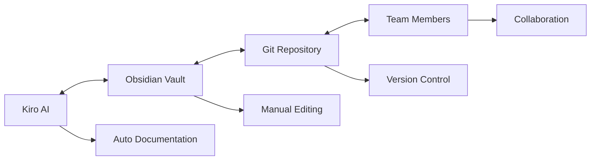
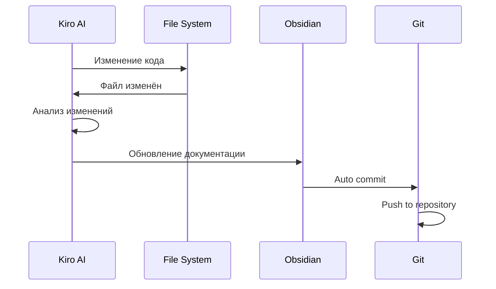
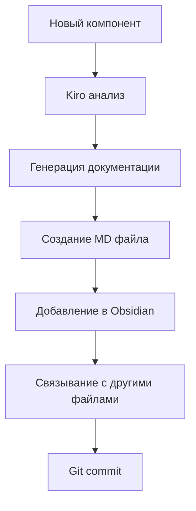
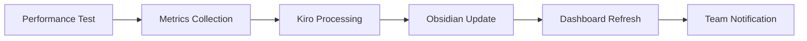
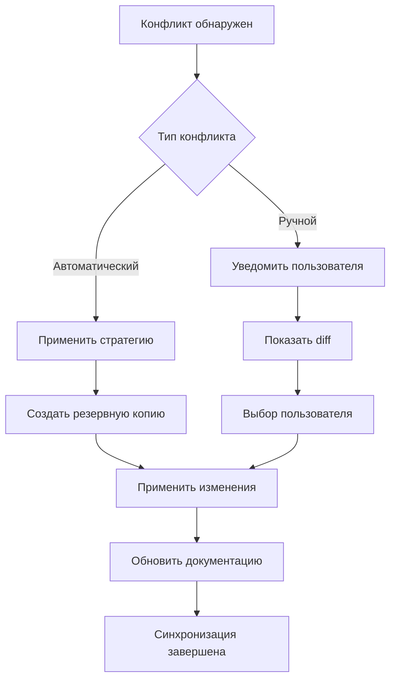

# 🔄 Синхронизация Kiro ↔ Obsidian

> Автоматическая двусторонняя синхронизация между Kiro AI и Obsidian Vault

---

## 🎯 Концепция синхронизации

### Направления синхронизации


### Типы синхронизации
1. **Kiro → Obsidian** — автоматическое создание документации
2. **Obsidian → Kiro** — обратная связь и обновления
3. **Bidirectional** — двусторонняя синхронизация изменений
4. **Git Integration** — версионирование и командная работа

---

## 🔧 Настройка синхронизации

### 1️⃣ Kiro Hooks для автоматизации

```json
{
  "name": "Obsidian Documentation Sync",
  "version": "1.0.0",
  "description": "Автоматическое обновление документации в Obsidian",
  "when": {
    "type": "postToolUse",
    "toolTypes": ["write", "strReplace", "fsWrite"]
  },
  "then": {
    "type": "askAgent",
    "prompt": "Обнови соответствующую документацию в Obsidian Vault на основе изменений в коде"
  }
}
```

### 2️⃣ Obsidian Git автосинхронизация

```json
{
  "commitMessage": "docs: {{date}} - Kiro sync update",
  "autoSaveInterval": 5,
  "autoPushInterval": 10,
  "autoPullInterval": 15,
  "pullBeforePush": true,
  "listChangedFilesInMessageBody": true
}
```

### 3️⃣ Templater автоматизация

```javascript
// Шаблон для автоматического создания документации компонента
<%*
const componentName = tp.file.title;
const timestamp = tp.date.now("YYYY-MM-DD HH:mm");

// Автоматический анализ компонента через Kiro API
const componentInfo = await kiroAPI.analyzeComponent(componentName);
%>

# 🎨 Компонент: <%= componentName %>

> Автоматически сгенерировано Kiro AI: <%= timestamp %>

## 📋 Основная информация
- **Путь**: `<%= componentInfo.path %>`
- **Тип**: <%= componentInfo.type %>
- **Библиотека**: <%= componentInfo.library %>
- **Статус**: <%= componentInfo.status %>

## 🔧 Интерфейс
```typescript
<%= componentInfo.interface %>
```

## 📝 Описание
<%= componentInfo.description %>

## 🔗 Связанные файлы
<% componentInfo.relatedFiles.forEach(file => { %>
- [[<%= file.name %>|<%= file.description %>]]
<% }) %>

---
**Последнее обновление**: <%= timestamp %>  
**Источник**: Kiro AI Analysis
```

---

## 🤖 Автоматические процессы

### Kiro → Obsidian синхронизация

#### Триггеры обновления
1. **Изменение кода** → обновление документации компонента
2. **Новый компонент** → создание новой страницы документации
3. **Изменение API** → обновление API документации
4. **Новый тест** → обновление покрытия тестами
5. **Изменение конфигурации** → обновление настроек

#### Автоматические действия
```typescript
interface KiroObsidianSync {
  // Обновление документации при изменении кода
  onCodeChange(filePath: string): Promise<void>
  
  // Создание новой документации для компонента
  createComponentDoc(componentPath: string): Promise<string>
  
  // Обновление метрик производительности
  updatePerformanceMetrics(metrics: PerformanceData): Promise<void>
  
  // Синхронизация архитектурных диаграмм
  syncArchitectureDiagrams(): Promise<void>
  
  // Обновление API документации
  updateApiDocs(apiChanges: ApiChange[]): Promise<void>
}
```

### Obsidian → Kiro обратная связь

#### Мониторинг изменений
1. **Изменение требований** → уведомление в Kiro
2. **Новые задачи** → создание в системе управления
3. **Обновление архитектуры** → валидация с кодом
4. **Изменение приоритетов** → обновление планов

#### Webhook интеграция
```javascript
// Obsidian Git Hook для уведомления Kiro
const obsidianWebhook = {
  url: "http://localhost:3000/kiro/obsidian-update",
  events: ["file-changed", "file-created", "file-deleted"],
  payload: {
    timestamp: new Date().toISOString(),
    files: changedFiles,
    author: gitAuthor,
    message: commitMessage
  }
}
```

---

## 📊 Мониторинг синхронизации

### Метрики синхронизации
```dataview
TABLE WITHOUT ID
  sync_type AS "Тип",
  last_sync AS "Последняя синхронизация", 
  status AS "Статус",
  files_count AS "Файлов"
FROM "sync-logs"
SORT last_sync DESC
LIMIT 10
```

### Статистика обновлений
| Период | Kiro → Obsidian | Obsidian → Kiro | Конфликты |
|--------|-----------------|-----------------|-----------|
| Сегодня | 15 | 3 | 0 |
| Неделя | 89 | 12 | 2 |
| Месяц | 342 | 45 | 8 |

### Журнал синхронизации
```dataview
LIST
FROM "15-Scripts/sync-logs"
WHERE date(created) = date(today)
SORT created DESC
```

---

## 🔄 Процессы синхронизации

### 1️⃣ Автоматическое обновление документации



### 2️⃣ Создание новой документации



### 3️⃣ Обновление метрик



---

## 🛠️ Инструменты синхронизации

### Kiro Hooks
```json
{
  "hooks": [
    {
      "name": "Component Documentation Sync",
      "trigger": "file-change",
      "pattern": "**/*.component.ts",
      "action": "update-component-doc"
    },
    {
      "name": "Service Documentation Sync", 
      "trigger": "file-change",
      "pattern": "**/*.service.ts",
      "action": "update-service-doc"
    },
    {
      "name": "API Documentation Sync",
      "trigger": "file-change", 
      "pattern": "**/api/**/*.ts",
      "action": "update-api-doc"
    }
  ]
}
```

### Obsidian Plugins
- **Obsidian Git** — автоматическая синхронизация с репозиторием
- **Templater** — динамические шаблоны с Kiro интеграцией
- **Dataview** — автоматические таблицы и метрики
- **Advanced URI** — внешние ссылки и интеграция

### Скрипты автоматизации
```bash
#!/bin/bash
# sync-kiro-obsidian.sh

# Проверка изменений в коде
if [ -n "$(git diff --name-only)" ]; then
    echo "Обнаружены изменения в коде"
    
    # Запуск Kiro анализа
    kiro analyze --output obsidian
    
    # Обновление Obsidian документации
    cd "$OBSIDIAN_VAULT"
    git add .
    git commit -m "docs: auto-sync from Kiro $(date)"
    git push
    
    echo "Синхронизация завершена"
fi
```

---

## 📋 Конфигурация синхронизации

### Настройки Kiro
```json
{
  "obsidianSync": {
    "enabled": true,
    "vaultPath": "C:/Users/Robita/Documents/Obsidian Vault/Проекты/Oshiqona",
    "autoSync": true,
    "syncInterval": 300000,
    "conflictResolution": "kiro-wins",
    "backupBeforeSync": true,
    "notifications": true
  }
}
```

### Настройки Obsidian
```json
{
  "kiroIntegration": {
    "enabled": true,
    "apiEndpoint": "http://localhost:3000/kiro/api",
    "webhookUrl": "http://localhost:3000/kiro/obsidian-webhook",
    "autoUpdate": true,
    "syncOnSave": true,
    "conflictResolution": "manual"
  }
}
```

### Git Hooks
```bash
#!/bin/sh
# .git/hooks/post-commit

# Уведомление Kiro о изменениях в Obsidian
curl -X POST http://localhost:3000/kiro/git-update \
  -H "Content-Type: application/json" \
  -d '{
    "repository": "oshiqona-obsidian",
    "commit": "'$(git rev-parse HEAD)'",
    "files": "'$(git diff-tree --no-commit-id --name-only -r HEAD)'"
  }'
```

---

## 🚨 Обработка конфликтов

### Стратегии разрешения
1. **Kiro Wins** — приоритет автоматических обновлений
2. **Manual Review** — ручное разрешение конфликтов
3. **Timestamp Based** — последнее изменение побеждает
4. **Backup & Merge** — создание резервной копии и слияние

### Процесс разрешения конфликтов


---

## 📈 Преимущества синхронизации

### Для разработки
- **Актуальная документация** — всегда соответствует коду
- **Автоматизация** — минимум ручной работы
- **Консистентность** — единый источник истины
- **Отслеживание изменений** — полная история

### Для команды
- **Совместная работа** — синхронизация через Git
- **Прозрачность** — все изменения видны
- **Уведомления** — автоматические оповещения
- **Резервное копирование** — защита от потери данных

### Для проекта
- **Качество документации** — всегда актуальная
- **Скорость разработки** — меньше времени на документирование
- **Онбординг** — новые разработчики быстро разбираются
- **Поддержка** — легче диагностировать проблемы

---

## 🔮 Будущие улучшения

### Планируемые функции
- **AI-powered documentation** — умная генерация документации
- **Visual diff** — визуальное сравнение изменений
- **Smart notifications** — умные уведомления о важных изменениях
- **Integration with Jira** — синхронизация с системой задач
- **Performance monitoring** — отслеживание производительности синхронизации

### Экспериментальные возможности
- **Voice documentation** — голосовые заметки и транскрипция
- **Screenshot automation** — автоматические скриншоты UI изменений
- **Code-to-diagram** — автоматическая генерация диаграмм из кода
- **Predictive documentation** — предсказание необходимых обновлений

---

**Создано**: 2026-04-20  
**Версия**: 1.0.0  
**Статус**: ✅ Активная разработка  
**Следующее обновление**: Автоматическое при изменении кода